# Deep Feature Interpolation
Implementation of the Deep Feature Interpolation for Image Content Changes [paper](https://arxiv.org/abs/1611.05507) in tensorflow.

The goal is to add a specific target feature to the face of a person. This may be a Mustache or a smiling mouth. The procedure starts with taking `k` images of people with the feature and `k` images of people without the feature. These sets (positive/negative) are the input to an - on IMAGENET pretrained - VGG19 network. The output of each image is then fetched at the Relu layers of the third, fourth and fifth convolutional block. This builds a deep feature representation of an image. The deep feature vector of the target feature is then calculated by taking the difference of the mean of the positive and the negative set. To add the target feature to a new image, the target feature vector in the deep feature space will be added to the deep feature representation of this image. The image will then be restored by reverse mapping the deep feature values into the original pixel space, using an optimizer of your choice and the following loss function: 

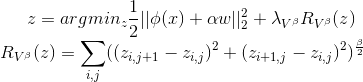

Where `z` is the new image, `x` is the input image, `phi` is the mapping into deep feature space, `alpha` is a scalar and `w` is the deep feature vector of the target feature.


## Examples
In these pictures a setting with the following parameters was used

| option | value |
| ------ | ----- |
|optimizer | adam |
|lr | 0.1 |
|k | 100 |
|alpha | 0.4 |
|beta | 2 |
|lamb | 0.001 |
|steps | 2000 |

### Start images

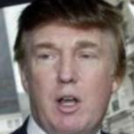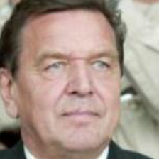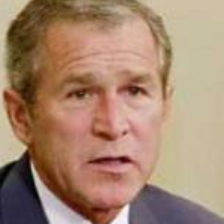

### Eyeglasses

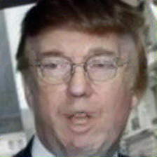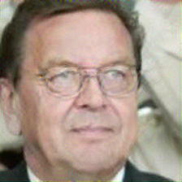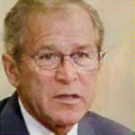

### Sunglasses
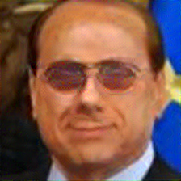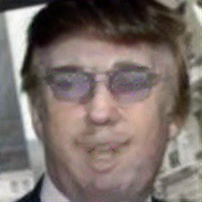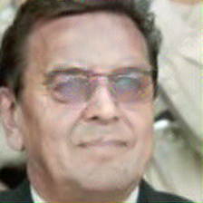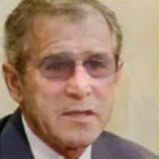

### Mustache
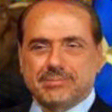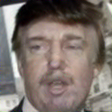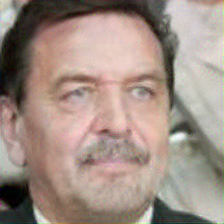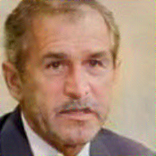
### Female
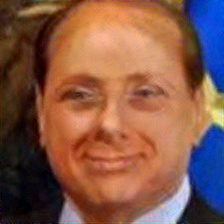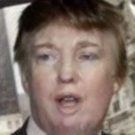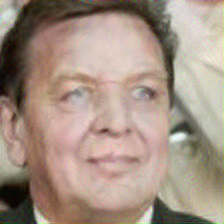
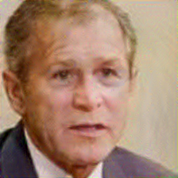
### Heavy Makeup
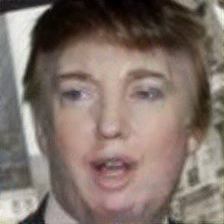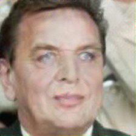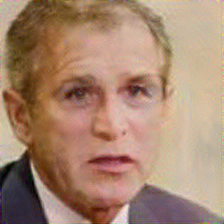

### Mouth wide open
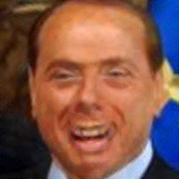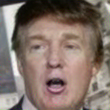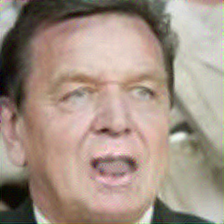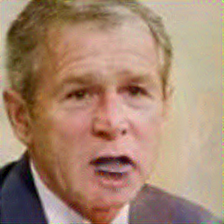

### Smiling
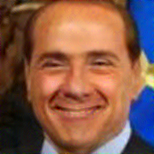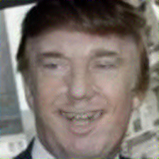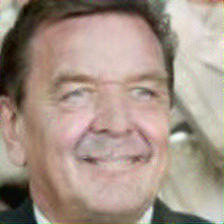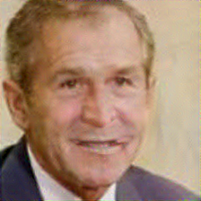
### Asian
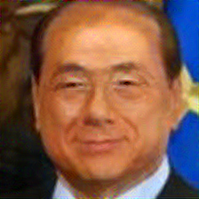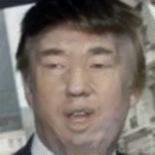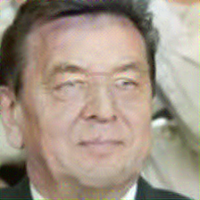
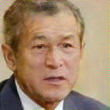
#### Example execution
```bash
./env/bin/python dfi-tensorflow/src/main.py -d dfi-tensorflow/data/ \
                -m vgg19.npy \      # Select the model
                -g \                # Enable gpu
                --optimizer adam \  # Use adam optimizer
                --steps 2000 \      # Set steps
                --lr 0.1 \          # Set learning rate
                --rebuild-cache \   # Disable caching
                --k 100 \           # Use 100 nearest neighbours for each set
		        --lamb 0.001 \      # Set lambda
                --beta 2 \          # Set beta
                --alpha 0.4 \       # Set alpha
                -f 'Mustache' \     # Select feature 'Mustache'
		        --person-image dfi-tensorflow/data/lfw-deepfunneled/Donald_Trump/Donald_Trump_0001.jpg 
                                    # Start with Trump as input image
```

## Setup
#### Model
Download the VGG19 model from [here](https://mega.nz/#!xZ8glS6J!MAnE91ND_WyfZ_8mvkuSa2YcA7q-1ehfSm-Q1fxOvvs)

#### Data
Download the LFW-Dataset from [here](http://vis-www.cs.umass.edu/lfw/lfw-deepfunneled.tgz)

#### Python environment
Make sure you have `virtualenv` installed  
Run:
```bash
$ virtualenv -p /usr/bin/python3 env         # Create virtual python environment
$ ./env/bin/pip install -r requirements.txt  # Install all necessary requirements
```

#### Enable GPU usage
Follow [these instructions](http://www.computervisionbytecnalia.com/es/2016/06/deep-learning-development-setup-for-ubuntu-16-04-xenial/) up to point 4 to install CUDA on your system.

## Usage
```
$ ./env/bin/python src/main.py -h
usage: Deep Feature Interpolation [-h] [--data-dir DATA_DIR]
                                  [--model-path MODEL_PATH] [--gpu]
                                  [--num-layers NUM_LAYERS]
                                  [--feature FEATURE]
                                  [--person-index PERSON_INDEX]
                                  [--person-image PERSON_IMAGE]
                                  [--list-features] [--optimizer OPTIMIZER]
                                  [--lr LR] [--steps STEPS] [--eps EPS] [--tk]
                                  [--k K] [--alpha ALPHA] [--beta BETA]
                                  [--lamb LAMB] [--rebuild-cache]
                                  [--random-start] [--verbose] [--invert]

optional arguments:
  -h, --help            show this help message and exit
  --data-dir DATA_DIR, -d DATA_DIR
                        Path to data directory containing the images
  --model-path MODEL_PATH, -m MODEL_PATH
                        Path to the model file (*.npy)
  --gpu, -g             Enable gpu computing
  --num-layers NUM_LAYERS, -n NUM_LAYERS
                        Number of layers. One of {1,2,3}
  --feature FEATURE, -f FEATURE
                        Name of the Feature.
  --person-index PERSON_INDEX, -p PERSON_INDEX
                        Index of the start image.
  --person-image PERSON_IMAGE
                        Start image path.
  --list-features, -l   List all available features.
  --optimizer OPTIMIZER, -o OPTIMIZER
                        Optimizer type
  --lr LR               Learning rate interval in log10
  --steps STEPS, -s STEPS
                        Number of steps
  --eps EPS, -e EPS     Epsilon interval in log10
  --tk                  Use TkInter
  --k K, -k K           Number of nearest neighbours
  --alpha ALPHA, -a ALPHA
                        Alpha param
  --beta BETA, -b BETA  Beta param
  --lamb LAMB           Lambda param
  --rebuild-cache, -rc  Rebuild the cache
  --random-start, -rs   Use random start_img
  --verbose, -v         Set verbose
  --invert, -i          Invert deep feature difference (No Beard -> Beard)
```
